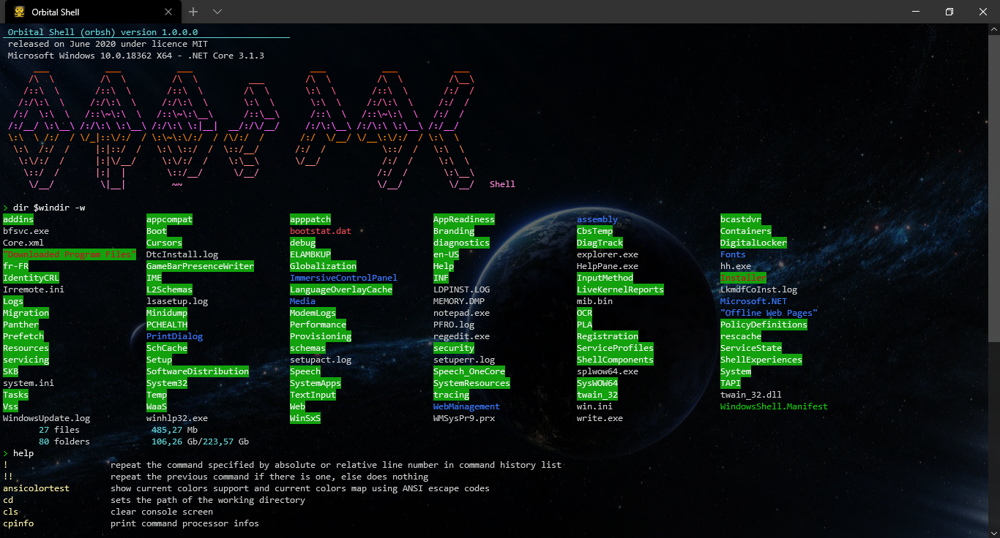

# Dot Net Console App Toolkit
<b>Dot Net Console App Toolkit</b> helps build fastly nice multi-plateforms (windows, linux, macos) console applications using C# and .NET Core 3.1 and .NET Standard 2.1

[](license.md) This project is licensed under the terms of the MIT license: [LICENSE.md](LICENSE.md)

# Index

- [Features](https://github.com/franck-gaspoz/dotnet-console-app-toolkit/blob/master/README.md#features)
- [Example: Orbital Shell (orbsh)](https://github.com/franck-gaspoz/dotnet-console-app-toolkit/blob/master/README.md#orbsh)
- [Packages dependencies](https://github.com/franck-gaspoz/dotnet-console-app-toolkit/blob/master/README.md#packages-dependencies)

# Features

The toolkit provides functionalities needed to build console applications running in a terminal (WSL/WSL2, cmd.exe, ConEmu, bash, ...) with text interface. That includes:
- <b>a text printer engine </b>that supports <b>print directives</b> allowing to manage console functionalities from text itself, as html would do but with a simplest grammar (that can be configured). That makes possible colored outputs, cursor control, text scrolling and also dynamic C# execution (scripting), based on several APIs like <b>System.Console</b> and <b> ANSI VT100 / VT52</b>. The print directives are available as commands strings, as a command from the integrated shell or from an underlying shell

    ``` csharp
    // -- example of a string containing print directives --
    
    // 1) from the toolkit shell command line:
    Println "(br,f=yellow,b=red)yellow text on red background(br)(f=cyan)current time is: (exec=System.DateTime.Now,br)"
    
    // 2) invoking the tookit:
    mupsh.exe "(br,f=yellow,b=red)yellow text on red background(br)(f=cyan)current time is: (exec=System.DateTime.Now,br)"
    
    // 3) from C# using DotNetConsole.cs
    Println($"{Br}{Yellow}{BRed}yellow text on red background{Br}{Cyan}current time is: {System.DateTime.Now}{Br}");
     ```
     <image src="Doc/Images/2020-06-13 06_18_08-Window.png"/>
    
- <b>UI controls</b> for displaying texts and graphical characters in a various way and handling user inputs

- <b>command line analyser / interpretor</b> with an adaptable syntax, that can interact with any underlying shell, allowing to build either a stand alone shell or an extension for an existing shell

- <b>a simple way to define shell commands</b> using C# method and parameters attributes, avoiding the developer to handle syntax analyzing and shell integration (command help, pipelines, standard stream redirections) councerns, allowing to support either simple values types (int,float,string,date time,..) and object types (even generic collection), and that can interacts together and with the shell throught data objects

    ``` csharp
    // a Unix rm command implementation:
    [Command("remove file(s) and/or the directory(ies)")]
    public List<string> Rm(
        [Parameter("file or folder path")] WildcardFilePath path,
        [Option("r", "also remove files and folders in sub directories")] bool recurse,
        [Option("i","prompt before any removal")] bool interactive,
        [Option("v", "explain what is being done")] bool verbose,
        [Option("d", "remove empty directories")] bool rmEmptyDirs,
        [Option("na", "do not print file system attributes when verbose")] bool noattributes,
        [Option("s", "don't remove any file/or folder, just simulate the operation (enable verbose)")] bool simulate
    )
    {
        var r = new List<string>();
        if (path.CheckExists())
        {
            /* ... */
        }
        return r;
    }
    ```
  - that will be auto documented like this by the integrated shell (mupsh):
  
    <image src="Doc/Images/2020-06-13 06_36_43-Window.png"/>

- <b>libraries of methods</b> for performing various print operations, data conversions, process management, ..

- <b>data types</b> related to the system and the environment that provides usefull methods

- <b>shell commands</b> that allows to run a complete shell, containing the most usefull and usual commands of a traditional shell (dir/ls, cd, rm, mv, find, more, ...), with user session and extensibility (commands modules that can be installed and uninstalled from repositories)

## Example : Orbital Shell (orbsh)

<a href="#orbsh">

</a>

This is a view of what is done with the C# project <a href="https://github.com/franck-gaspoz/dotnet-console-app-toolkit-shell"><b>orbital-shell</b></a>. The <b>Dot Net Console App Toolkit</b> integrates anything needed to run a complete shell, writes shell commands using C# and use console UI components.

> ### :information_source: &nbsp;&nbsp;&nbsp;&nbsp;How this example is coded ?
> This shell example runs with just a few lines of code:

``` csharp
    var commandLineProcessor = new CommandLineProcessor(args);
    var commandLineReader = new CommandLineReader(commandLineProcessor);
    var returnCode = commandLineReader.ReadCommandLine();
    Environment.Exit(returnCode);
```

## Packages dependencies:

Microsoft.CodeAnalysis.CSharp.Scripting 3.7.0-1.final
